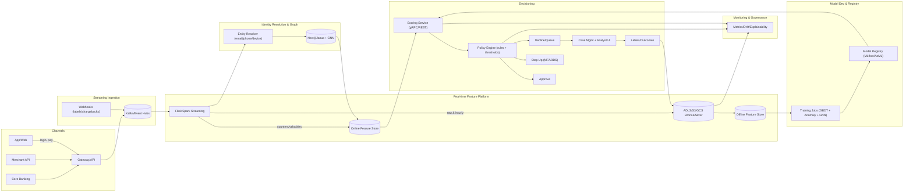

# Reference Architecture (Kappa, stream-first)

- Azure mapping: API Management + Event Hubs; ADLS Gen2; Databricks Structured Streaming or Flink on AKS; Azure Cache for Redis; Delta/Synapse + Feast; Azure ML/MLflow; AKS/Functions; CosmosDB (Gremlin)/Neo4j Aura; CosmosDB + Web App/AKS; App Insights + Prometheus/Grafana.
- GCP alt: Cloud Endpoints + Pub/Sub; BigQuery + GCS; Dataflow (Flink); MemoryStore (Redis); Feast + BigQuery; Vertex AI; Neo4j Aura/JanusGraph; Cloud Run/GKE; Cloud Monitoring.

Latency budgets
- Features: 50–100 ms online
- Score + policy: < 150 ms end-to-end
