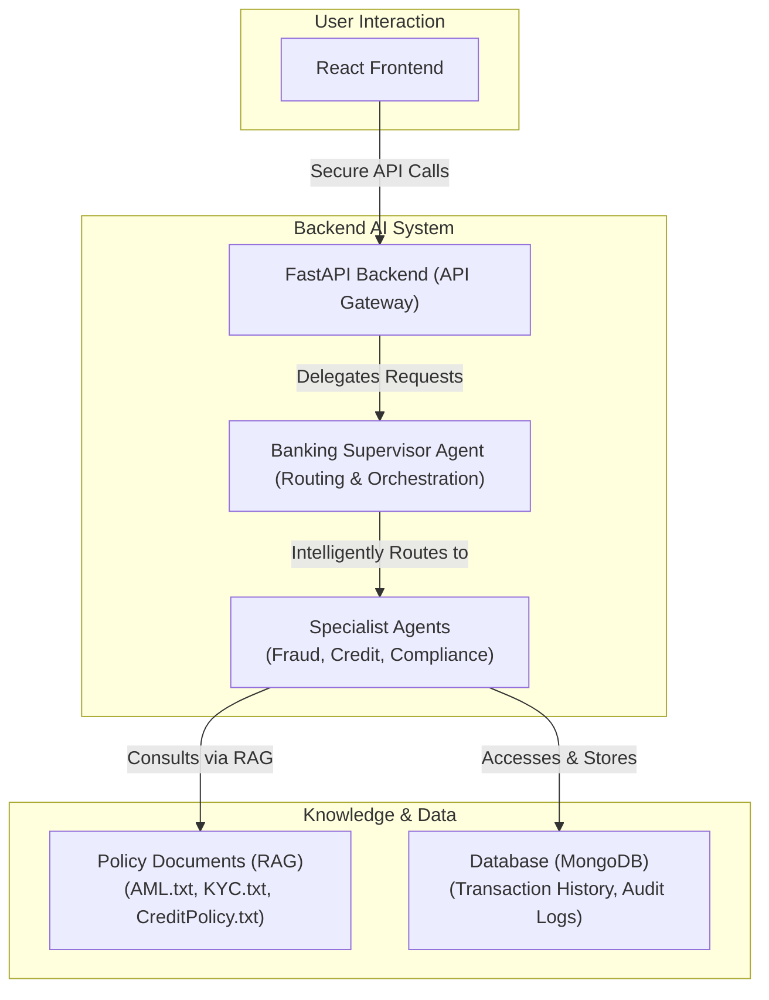
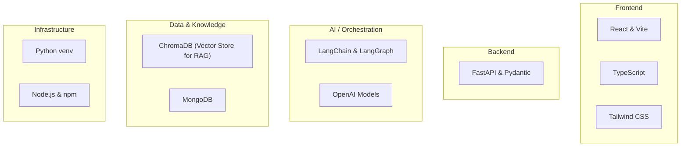

# Intelligent Banking Operations Agent 🤖🏦

This project is a sophisticated, AI-powered multi-agent system designed to automate and enhance critical banking operations. It provides a blueprint for building secure, compliant, and intelligent financial systems using a modern technology stack. The system features specialized AI agents for real-time fraud detection and in-depth credit risk analysis, all orchestrated by a central supervisor and grounded in verifiable policy documents through Retrieval-Augmented Generation (RAG).

## The Challenge: Speed vs. Safety in Modern Banking

Modern financial institutions face a fundamental dilemma. Customers expect instantaneous transactions and loan approvals, yet the threat of sophisticated fraud and the burden of complex regulatory compliance have never been greater. This creates a high-stakes balancing act:

1.  **Speed vs. Safety**: How can a bank approve a transaction in milliseconds while simultaneously verifying its legitimacy against complex fraud patterns?
2.  **Fairness and Consistency**: How can an institution ensure that every loan officer, in every branch, makes decisions that are not only fair and unbiased but also strictly adhere to hundreds of pages of internal credit policies?
3.  **Information Overload**: How can human analysts be expected to process dozens of documents and thousands of data points for a single application quickly and accurately, without missing critical details?

Traditionally, these challenges were met by hiring armies of human analysts. While essential, this approach is often slow, costly, and prone to human error. Our project introduces a modern, AI-native solution.

## The Solution: A Collaborative AI Workforce

We have developed a team of specialized AI agents that work together as a digital workforce. These agents don't replace human experts; they empower them by handling the repetitive, data-intensive work, allowing them to focus on the most complex and nuanced cases.

-   🕵️‍♀️ **Fraud Triage Agent**: A master detective that analyzes transaction details in real-time, using data and policy to sniff out suspicious activity.
-   📉 **Credit Risk Agent**: A seasoned underwriter that evaluates loan applications with incredible speed and accuracy, ensuring every decision is consistent and policy-compliant.
-   📜 **Compliance RAG Agent**: A diligent compliance officer with instant recall of every single policy and regulation, providing the factual grounding for all agent decisions.
-   👨‍⚖️ **Banking Supervisor**: The team captain, intelligently analyzing incoming requests and routing them to the appropriate specialist agent.

---

## 🏗️ System Architecture

The system is built on a modern, decoupled architecture designed for scalability, maintainability, and security. A React-based user interface communicates with a high-performance FastAPI backend. The backend's API layer acts as the gateway to the core AI logic, where the Banking Supervisor routes tasks to the appropriate specialist agents. These agents, in turn, use a Retrieval-Augmented Generation (RAG) system to consult an indexed knowledge base of policy documents, ensuring their decisions are always grounded in fact.



---

## ✨ Key Features Deep Dive

### 1. AI-Powered Credit Risk Assessment

The `CreditRiskAgent` transforms credit assessment from a rigid, manual process into an intelligent, transparent, and dynamic one.

-   **Old Way**: Manual scorecard calculations and hard-coded business rules that are slow, inflexible, and extremely difficult to update as policies change.
-   **Our Way**: The agent leverages **Retrieval-Augmented Generation (RAG)** for a "show your work" approach.
    1.  It receives a loan application and calculates key financial metrics (e.g., Debt-to-Income ratio).
    2.  It forms a query based on the applicant's profile and queries the bank's `CreditPolicy.txt` document, retrieving the most relevant sections in real-time.
    3.  A Large Language Model (LLM) synthesizes the applicant's data with the retrieved policy snippets to generate a final decision.
-   **The Result**: A detailed, policy-grounded rationale that **explicitly cites the policy sections** used to make the decision. This makes every approval or denial transparent, auditable, and instantly adaptable to policy updates.

### 2. Next-Generation Fraud Detection

The `FraudTriageAgent` provides a holistic, context-aware approach to security that goes far beyond simple rule-based systems.

-   **Old Way**: Brittle `if-then` rules (e.g., `IF amount > $1000 THEN flag`) that are easily bypassed by clever fraudsters and generate a high number of false positives.
-   **Our Way**: The agent uses an LLM to perform a comprehensive, multi-faceted analysis.
    1.  It builds a rich context for the transaction, including velocity counts (transactions per hour), geo-location novelty, device reputation, and statistical anomalies in spending behavior.
    2.  It uses RAG to pull relevant AML (Anti-Money Laundering) and KYC (Know Your Customer) policies for additional context.
    3.  The LLM provides a risk analysis in plain English, explaining *why* a transaction is suspicious based on the interplay between the data and the relevant policies.
-   **The Result**: The ability to detect complex and novel fraud patterns and provide clear, human-readable explanations that drastically reduce the time needed for manual analyst reviews.

---

## 🛠️ Tech Stack

This project is built on the shoulders of powerful, modern tools and frameworks, chosen for performance, developer experience, and scalability.



---

## 🚀 Getting Started

Follow these instructions to get the project up and running on your local machine for development and testing purposes.

### Prerequisites

-   Python (3.11+ recommended)
-   Node.js (v18+) & npm
-   Git

### 1. Clone the Repository

```bash
git clone <repository_url>
cd Intelligent_Banking_Operations_Agent
```

### 2. Set Up Environment Variables

The system uses a `.env` file for configuration. In the root directory `Intelligent_Banking_Operations_Agent/`, create a file named `.env` and add the following. An OpenAI key is required for the RAG-powered features.

```env
# Get your key from https://platform.openai.com/api-keys
OPENAI_API_KEY="your_openai_api_key_here"

# Optional: For tracing and debugging with LangSmith (https://smith.langchain.com/)
LANGCHAIN_TRACING_V2="true"
LANGCHAIN_API_KEY="your_langsmith_api_key_here"
LANGCHAIN_PROJECT="Intelligent Banking Ops"
```

Next, create a `.env` file inside `Intelligent_Banking_Operations_Agent/frontend/` with the following content to link the frontend to the local backend API:

```env
VITE_API_BASE=http://127.0.0.1:8000/api/v1
VITE_USE_MOCKS=false
```

### 3. Backend Setup (Python)

From the project root, create and activate a Python virtual environment.

**On Windows (PowerShell):**
```powershell
# You may need to run this first to allow script execution
Set-ExecutionPolicy -ExecutionPolicy RemoteSigned -Scope Process

# Create and activate the virtual environment
python -m venv .venv
.\.venv\Scripts\Activate.ps1
```

**On macOS/Linux:**
```bash
python3 -m venv .venv
source .venv/bin/activate
```

Once the environment is activated, install the required dependencies:
```bash
pip install -r requirements.txt
```

### 4. Frontend Setup (React)

In a **new terminal**, navigate to the frontend directory, and install the Node.js dependencies:
```bash
cd Intelligent_Banking_Operations_Agent/frontend
npm install
```

### 5. Run the Application

The system requires two separate processes running in two separate terminals.

**Terminal 1: Start the Backend (FastAPI Server)**
Make sure you are in the `Intelligent_Banking_Operations_Agent/Intelligent_Banking_Operations_Agent` directory with your Python virtual environment activated.
```bash
python -m uvicorn main:app --reload
```
The API server will be running at `http://127.0.0.1:8000`.

**Terminal 2: Start the Frontend (Vite Dev Server)**
Make sure you are in the `Intelligent_Banking_Operations_Agent/frontend` directory.
```bash
npm run dev
```
The React application will open in your browser, usually at `http://localhost:5173`.

You can now interact with the application! For a live API playground, visit the auto-generated docs at `http://localhost:8000/docs`.

---

## 🔭 Future Directions

This project serves as a robust foundation. The immediate roadmap includes:
1.  **Full `BankingSupervisor` Integration**: Complete the transition to a single, intelligent API endpoint that uses the supervisor and `LangGraph` to orchestrate complex, multi-agent workflows.
2.  **Activate `ComplianceRAGAgent` Across All Agents**: Ensure that all agent rationales are fully grounded in and cite specific policy documents for complete auditability.
3.  **Enhance Agent Tools**: Add real-time database connectivity and third-party API tools (e.g., for identity verification) to allow agents to work with dynamic, real-world data.